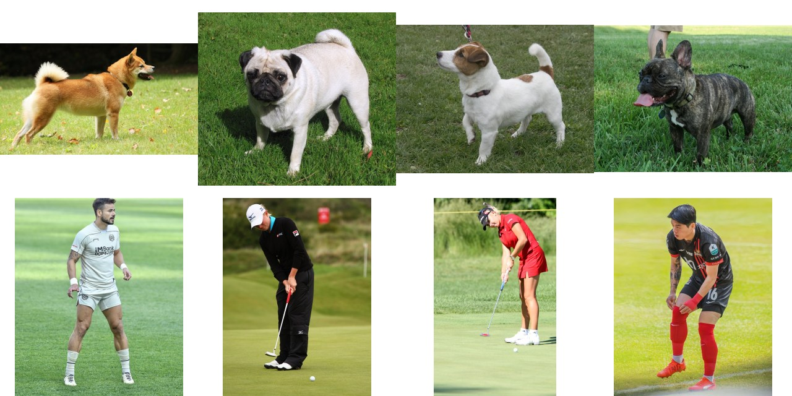
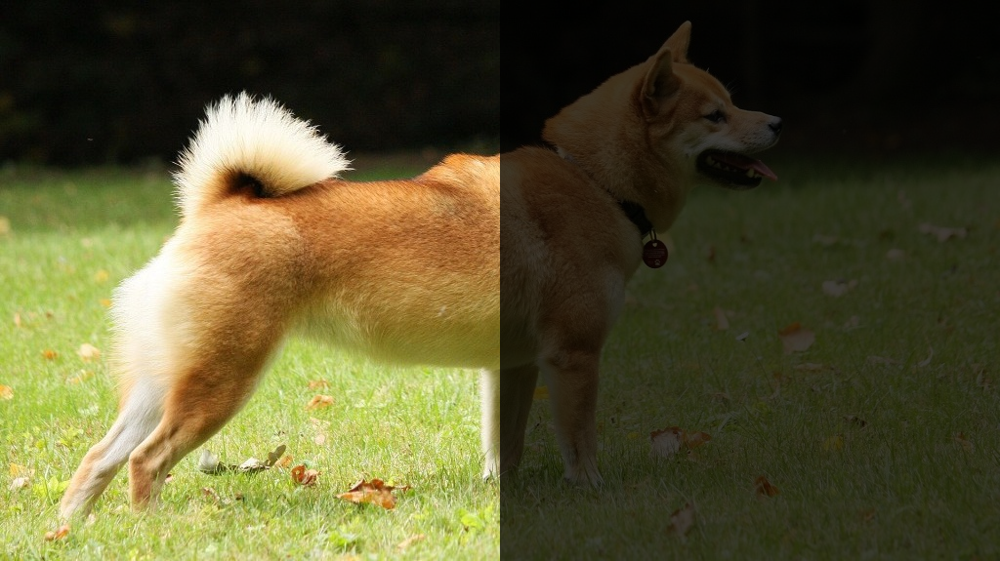
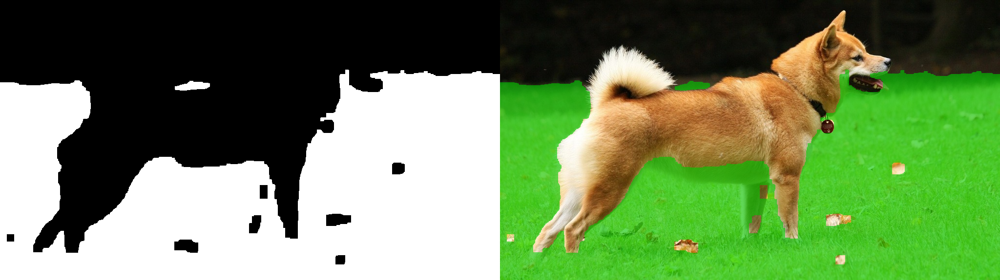
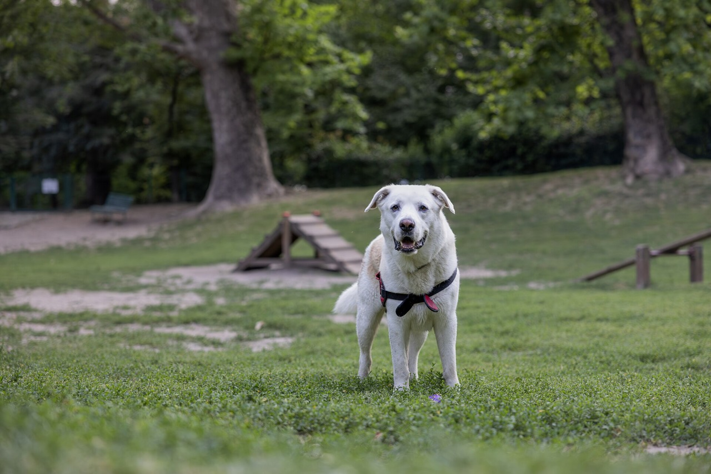
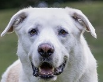
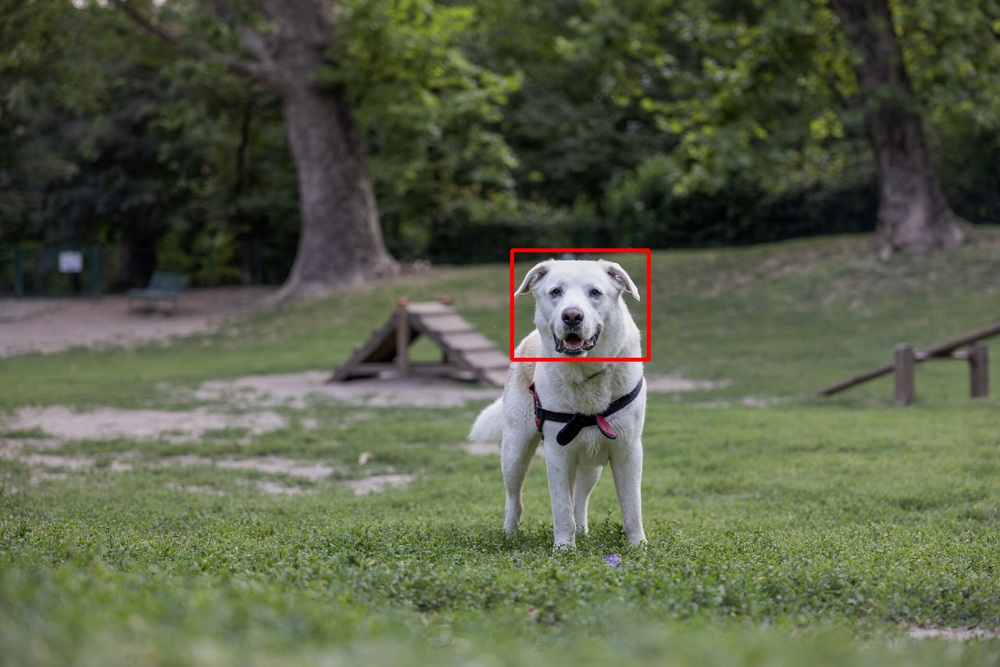
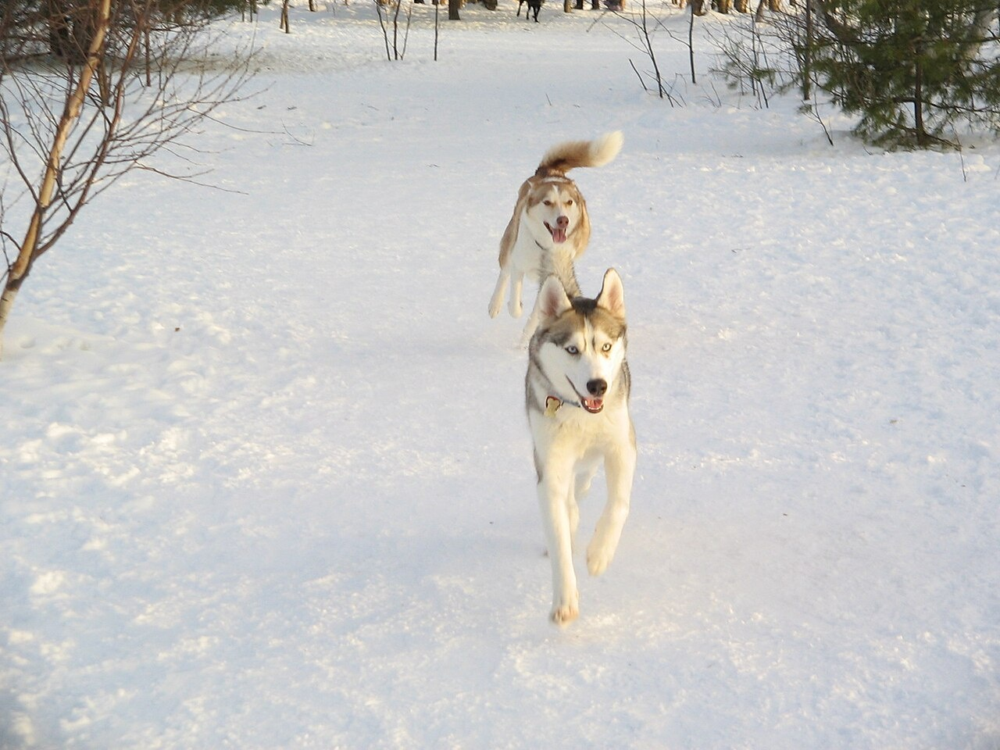
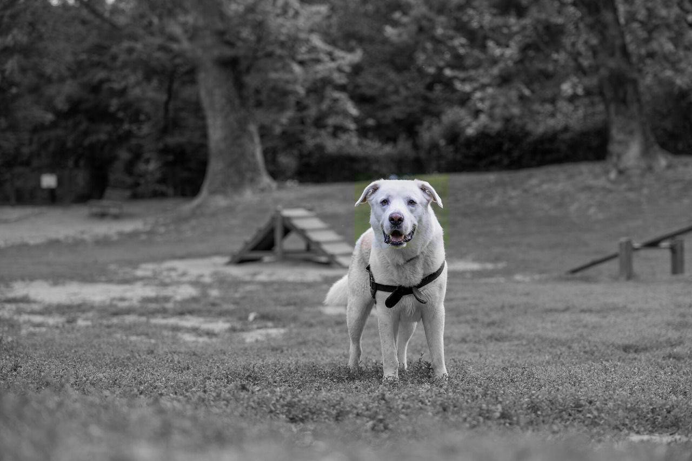

Parte 2 - SAVI

Miguel Riem Oliveira <mriem@ua.pt>
2026-2027

# Sumário

- As quatro tarefas clássicas do processamento de imagem:
  1. Pré-processamento - transformar a imagem sem lhe mudar o conteúdo
  2. Segmentação - dividir a imagem em regiões
  3. Classificação - que objeto é este?
  4. Deteção - onde está o objeto na imagem?

Todos os exercícios usam o mesmo conjunto de imagens, na pasta `images/`:
cães e pessoas fotografados sobre relva (`dog_1.jpg` a `dog_4.jpg`,
`person_1.jpg` a `person_4.jpg`) e um cenário de parque com vários cães
(`cenario.jpg`). Cada tarefa aproveita o que se fez na anterior.

# Exercícios

## 1. Pré-processamento

### Exercício 1a - Carregar e inspecionar

Carregue a imagem `dog_1.jpg` do disco e mostre-a numa janela.

Uma imagem em OpenCV é um _array_ do numpy. Imprima a forma (`shape`), o tipo
(`dtype`) e o valor de um píxel à escolha. Que significam os três números da
forma? Qual é a ordem dos canais de cor?

### Exercício 1b - Operações sobre a imagem

Sobre a mesma imagem, faça e mostre o resultado de cada operação:

- recortar a região que contém apenas o cão (indexação do _array_);
- redimensionar a imagem para metade do tamanho;
- converter para tons de cinzento;
- desfocar com um filtro gaussiano;
- aumentar e diminuir o brilho.

Observe que nenhuma destas operações altera o que está na imagem. Continua a
ser o mesmo cão na mesma relva. Só muda a forma como a imagem é representada.

### Exercício 1c - Anoitecer

Diminua a intensidade dos píxeis da metade direita da imagem, dividindo os seus
valores por uma constante, para simular uma fotografia noturna.

Depois faça um anoitecer progressivo, variando o valor do divisor ao longo do
tempo. Grave um vídeo com o processo de anoitecer da imagem.

## 2. Segmentação

Segmentar é dividir a imagem em regiões com significado. Nestas imagens há
duas regiões óbvias: a relva e o objeto que está sobre ela, seja um cão ou uma
pessoa.

### Exercício 2a - Segmentar a relva em BGR

Tente separar a relva do resto da imagem `dog_1.jpg` com limiares sobre os
canais B, G e R. Que acontece nas zonas de sombra e nas zonas mais iluminadas
da relva?

### Exercício 2b - Segmentar a relva em HSV

Converta a imagem para o espaço de cor HSV e mostre cada um dos três canais
separadamente. Em qual deles a relva se distingue melhor?

Segmente a relva com limiares sobre a matiz (H) e a saturação (S). Compare com
o resultado do exercício anterior.

### Exercício 2c - Limpar a máscara e encontrar o objeto

A máscara tem buracos e pontos soltos. Use operações morfológicas (abertura e
fecho) para a limpar.

Inverta a máscara da relva. O que sobra é o cão e alguma coisa mais. Fique
apenas com o maior componente conexo e desenhe o retângulo que o envolve.

### Exercício 2d - As mesmas regras noutras imagens

Corra o programa, sem alterar os limiares, sobre `dog_2.jpg`, `person_1.jpg` e
`person_3.jpg`. Funciona em todas? Ajuste os limiares até obter uma máscara
razoável nas oito imagens de cães e pessoas.

## 3. Classificação

Classificar é responder à pergunta "que objeto é este?". Nesta aula a resposta
é `dog` ou `person`, e o programa tem de a dar a partir de medidas feitas sobre
a imagem.

Um classificador deve receber apenas o objeto, sem o fundo. Por isso a
classificação começa onde a segmentação acabou.

### Exercício 3a - Extrair o objeto

Usando o retângulo envolvente do exercício 2c, recorte a sub-imagem que contém
apenas o objeto e mostre-a. Faça-o para as oito imagens de cães e pessoas e
guarde os recortes em disco.

### Exercício 3b - Medir o objeto

Para cada recorte calcule:

- a relação altura/largura do retângulo;
- a fração da área do retângulo que está ocupada pela máscara do objeto;
- a cor média (em HSV) dentro da máscara.

Imprima uma tabela com o nome do ficheiro e as medidas. Qual das medidas
separa melhor os cães das pessoas?

### Exercício 3c - Escrever a regra

Uma pessoa de pé é muito mais alta do que larga. Um cão de pé é mais largo do
que alto, ou quase quadrado. Escolha um limiar para a relação altura/largura e
escreva a regra que classifica cada recorte como `dog` ou `person`. Mostre
cada imagem com o resultado escrito por cima.

A imagem `person_4.jpg` tem uma pessoa agachada. A regra ainda funciona? E se
fosse uma pessoa sentada, ou um cão em pé sobre as patas traseiras? Discuta
porque é que uma regra sobre a forma não chega para classificar objetos em
geral. As aulas de _deep learning_ vão responder a esta pergunta.

## 4. Deteção

Detetar é responder à pergunta "onde está o objeto?". Vamos procurar um cão
concreto num cenário de parque, `cenario.jpg`.

### Exercício 4a - Template matching

Carregue o cenário e o modelo `modelo.png`, que é um recorte da cabeça do cão.

Utilizando _template matching_ encontre a posição do modelo no cenário. Anote
a posição desenhando o retângulo correspondente ao modelo sobre o cenário.

### Exercício 4b - E os outros cães?

Experimente o mesmo programa nas seguintes situações:

- o cenário `cenario.jpg` reduzido a 60% do tamanho;
- o cenário `cenario_2.jpg`, com dois cães na neve, usando o mesmo modelo.

Explique porque é que o _template matching_ falha nestes casos.

### Exercício 4c - Criar o modelo com o rato

Crie um sistema de carregar e arrastar com o rato que permita ao utilizador
desenhar um retângulo sobre a imagem e usar o seu conteúdo como novo modelo.
Use-o para detetar cada um dos cães de `cenario_2.jpg`. Um modelo recortado
de um dos cães encontra o outro?

### Exercício 4d - Destacar o cão

Destaque a deteção colocando a cinzento tudo o que está fora do retângulo
detetado.

Para uma versão mais elaborada, use a máscara da relva do exercício 2 para
restringir a procura do modelo às zonas que não são relva.

# Créditos das imagens

As fotografias vêm do Wikimedia Commons e são usadas ao abrigo das licenças
indicadas em `images/creditos.md`.
