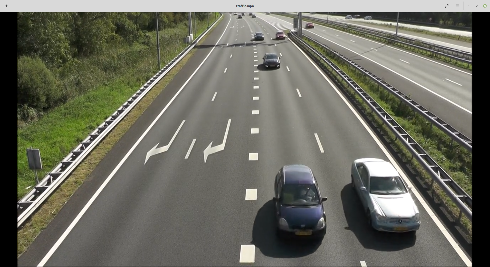

Parte 3 - SAVI
=============
Miguel Riem Oliveira <mriem@ua.pt>
2026-2027

# Sumário

- Processamento de vídeo

# Exercícios

## Exercício 1 - Controlo de tráfego

Utilize o vídeo **traffic.mp4** para fazer um sistema de contagem de veículos.
O objetivo é saber quantos veículos passaram.

## Exercício 2 - Controlo de tráfego

Obtenha a contagem separada para cada faixa de rodagem.

## Exercício 3 - Cor

O programa deve imprimir um relatório com os eventos de passagem de veículos, com a faixa de rodagem e a cor do veículo.

# Desafios

## Desafio 1 - Zonas de contagem escolhidas com o rato

Nos exercícios anteriores, a posição de cada zona de contagem está escrita no
código, em píxeis. Se a câmara mudar de sítio, ou se o vídeo for outro, é
preciso voltar a medir tudo à mão.

Divida o programa em dois scripts:

- `escolher_zonas.py`: mostra o primeiro frame do vídeo, deixa o utilizador
  desenhar com o rato uma zona de contagem por cada faixa de rodagem e guarda
  as zonas num ficheiro JSON (por exemplo `zonas.json`);
- `main.py`: lê as zonas do ficheiro JSON e faz a contagem por faixa com elas,
  sem mais nenhuma alteração ao código.

Assim, o `escolher_zonas.py` só precisa de ser corrido quando a câmara ou o
vídeo mudam. Se o ficheiro JSON não existir, o `main.py` deve avisar o
utilizador e terminar.

Para escolher as zonas pode usar a função `cv2.selectROIs`, ou reaproveitar o
sistema de carregar e arrastar do Exercício 4c da Parte 2
(`cv2.setMouseCallback`). Para ler e escrever o ficheiro use o módulo `json`
(`json.dump` e `json.load`).

## Desafio 2 - Quão bom é o contador?

Um sistema de visão só é útil se soubermos medir quantas vezes acerta e
quantas vezes se engana. Para isso é preciso comparar o que o programa deteta
com a verdade, anotada à mão.

### Desafio 2a - Anotar a referência

Escreva um pequeno programa de anotação: a tecla espaço pausa e retoma o vídeo,
as teclas `a` e `d` recuam e avançam um frame, e as teclas `1` a `4` registam a
passagem de um carro na faixa correspondente, no frame atual. No fim, o
programa deve guardar as anotações num ficheiro CSV com as colunas `faixa` e
`frame`.

Anote todos os carros que passam nas zonas de contagem. Com o vídeo em pausa e
a avançar frame a frame, decida em que frame cada carro entra na zona.

### Desafio 2b - Métricas

Altere o contador para que também guarde os seus eventos (faixa e frame) e
compare-os com a referência. Considere que uma deteção corresponde a um carro
da referência se for na mesma faixa e a menos de meio segundo de diferença.
Cada carro da referência só pode corresponder a uma deteção.

Para cada faixa, e para o total, conte:

- verdadeiros positivos (VP): carros detetados que existem na referência;
- falsos positivos (FP): deteções que não correspondem a nenhum carro;
- falsos negativos (FN): carros da referência que o programa não detetou.

Calcule a precisão `VP / (VP + FP)`. Em que faixas falha o contador? Observe
essas passagens no vídeo e explique porquê.

### Desafio 2c - Afinar o limiar

Corra o contador para vários valores do limiar de deteção e desenhe, com o
`matplotlib`, a precisão e o número de falsos negativos em função do limiar.

Se olhar apenas para a precisão, que limiar escolheria? Que problema tem essa
escolha? Que valor escolheria olhando para os dois gráficos?

## Desafio especial - Vista de cima

A câmara vê a estrada em perspetiva: as faixas convergem ao longe e um carro
parece mais pequeno e mais lento quanto mais longe está. Uma transformação de
perspetiva permite ver a estrada como se a câmara estivesse por cima dela.

Escolha com o rato quatro pontos sobre as linhas brancas que limitam a
estrada, de forma a formarem um trapézio. Use `cv2.getPerspectiveTransform`
para calcular a transformação que leva esse trapézio a um retângulo e
`cv2.warpPerspective` para gerar, frame a frame, a vista de cima.

Como pode verificar que a transformação está correta? Observe as linhas das
faixas e o espaçamento entre os traços. Observe também os carros: porque é que
aparecem esticados?

Para uma versão mais elaborada, faça a contagem por faixa na vista de cima.
Que vantagens tem em relação às zonas de contagem do Desafio 1?
