# Aula 4 — Detecção e Segmentação de objetos 

Introdução


### Ex1 Preparação de uma classe para representar bounding boxes

A deteção da localização de um objeto (o pedestre, neste caso) é uma tarefa chamada de regressão, onde se preveem valores contínuos para as coordenadas da bounding box. A sugestão é que esta rede tenha como saídas:

- Número de Saídas: 4 (quatro neurônios);
- Função de Ativação: Sigmoid;
- Função de Custo (Loss Function): Smooth L1 loss.

Cada um destes neurônios será responsável por prever um dos quatro valores que definem a bounding box:
- x: A coordenada X do centro da caixa, ou do canto superior esquerdo;
- y: A coordenada Y do centro da caixa, ou do canuuto superior esquerdo;
- w: A largura (width) da caixa;
- h: A altura (height) da caixa.

Note que podem haver diferentes convenções para representar uma bounding box, como por exemplo x_min, y_min, x_max, y_max ou x_center, y_center, w, h. A escolha depende da sua implementação, mas x, y, w, h é bastante comum e intuitiva. 

Em vez de prever diretamente as coordenadas em píxeis absolutos (que podem ter um grande intervalo de valores, dependendo do tamanho da imagem), é muito comum normalizar tanto as coordenadas do ground truth quanto as previsões da rede para um intervalo entre 0 e 1. Use uma função de ativação sigmoid para fazer com que a rede devolva os valores $x,y,w,h \in [0,1]$.

Para problemas de regressão, a função de custo **smooth L1 Loss** (ou Huber Loss) é uma função de custo que concilia as vantagens da L1 (erro absoluto) Loss e da L2 Loss (erro quadrático).
Para desvios reduzidos, comporta-se como a L2 Loss , garantindo um gradiente suave e uma otimização estável.
Para desvios maiores, atua como a L1 Loss , tornando-a menos sensível a outliers (valores muito discrepantes) e prevenindo o aumento excessivo dos gradientes.
Esta combinação confere-lhe robustez para a regressão de bounding boxes, sendo eficaz na otimização e menos impactada por previsões significativamente incorretas.

**a)**

Crie um novo ficheiro bbox.py que contem uma classe para representar bounding boxes. Faça um script de teste que crie e imprima duas  bounding boxes.

**b)**

Pretende-se utilizar a representação xyxy (x1,y1,x2,y2) mas também a representação xywh (x1,y1,w,h). Implemente o código necessário para que seja possível inicializar uma nova bounding box das duas formas.

**c)** 

A biblioteca pil permite gravar ou mostrar uma imagem, e também desenhar rectângulos como explicado em baixo.

    from PIL import ImagedRAW
    image = Image.open(image_filename).convert('RGB'
    draw = ImageDraw.Draw(image)
    draw.rectangle([x1, y1, x2, y2], outline=(255,0,0)', width=1, fill=None)

Implemente um método **`draw`** na classe Bbox que desenhe a bounding box numa imagem.


### Ex2 Leitura do Dataset Penn-Fudan

A [Penn-Fudan Database](https://www.cis.upenn.edu/~jshi/ped_html/) for Pedestrian Detection é um conjunto de dados (dataset) clássico no campo da visão computacional, especificamente concebido para a tarefa de detecção de peões. Foi lançado pela Universidade da Pensilvânia e pela Universidade de Fudan, sendo frequentemente utilizado como ponto de partida por estudantes e investigadores que exploram algoritmos de detecção de objetos.

O conjunto de dados é composto por um **total de 170 imagens**, contendo 345 instâncias de peões com as suas respetivas anotações de bounding box (caixas delimitadoras). As imagens retratam várias cenas urbanas, onde um ou mais peões podem estar presentes.

Embora seja relativamente pequeno em comparação com conjuntos de dados mais modernos como o COCO ou o KITTI, o Penn-Fudan foi fundamental para o desenvolvimento e avaliação de técnicas iniciais de detecção de objetos. A sua dimensão gerenciável torna-o um excelente recurso educacional para compreender os fundamentos da detecção, incluindo o pré-processamento de dados, a implementação de modelos que combinam classificação e regressão de bounding box, e a avaliação do desempenho para a localização de objetos.

**a)**

Descarregue o dataset [Penn-Fudan](https://www.cis.upenn.edu/~jshi/ped_html/). 

Explore o dataset para perceber como estão guardadas as imagens e os labels.

Ao contŕario do anterior, este dataset não está ainda dividido em partes de treino e teste. Uma divisão habitual é 80-20%. O dataset é composto por 170 imagens. 

Escolha aleatóriamente 170*80% = 136 imagens (e labels correspondentes) e copie manualmente para uma pasta **train**, e depois copie as restantes imagens e labels correspondentes para uma pasta **test**.

Em baixo um exemplo que verá com o comando **tree** das pastas criadas.

```bash
.
├─ train
|   ├── FudanPed00001.png
|   ├── FudanPed00002.png
|   ├── FudanPed00003.png
|   ├── ...
|   ├── FudanPed00074.png
|   ├── PennPed00001.png
|   ├── ...
|   └── PennPed00062.png
└── test
    ├── PennPed00063.png
    ├── PennPed00064.png
    ├── PennPed00065.png
    ├── ...
    └── PennPed00096.png
```

**b)**

Cada imagem tem um ficheiro de texto associado na pasta labels com a seguinte informação:

```yaml
# PedMasks :   Mask for each image, also in PNG format. Pixels are labeled 0 for background, or > 0 corresponding
to a particular pedestrian ID.

# Annotation:  Annotation information for each image.  Each file is in the following format (take FudanPed00001.txt as an example):

# Compatible with PASCAL Annotation Version 1.00
Image filename : "PennFudanPed/PNGImages/FudanPed00001.png"
Image size (X x Y x C) : 559 x 536 x 3
Database : "The Penn-Fudan-Pedestrian Database"
Objects with ground truth : 2 { "PASpersonWalking" "PASpersonWalking" }
# Note there may be some objects not included in the ground truth list for they are severe-occluded
# or have very small size.
# Top left pixel co-ordinates : (1, 1)

# Details for pedestrian 1 ("PASpersonWalking")
Original label for object 1 "PASpersonWalking" : "PennFudanPed"
Bounding box for object 1 "PASpersonWalking" (Xmin, Ymin) - (Xmax, Ymax) : (160, 182) - (302, 431)
Pixel mask for object 1 "PASpersonWalking" : "PennFudanPed/PedMasks/FudanPed00001_mask.png"

# Details for pedestrian 2 ("PASpersonWalking")
Original label for object 2 "PASpersonWalking" : "PennFudanPed"
Bounding box for object 2 "PASpersonWalking" (Xmin, Ymin) - (Xmax, Ymax) : (420, 171) - (535, 486)
Pixel mask for object 2 "PASpersonWalking" : "PennFudanPed/PedMasks/FudanPed00001_mask.png"
```

Portanto temos de criar na classe dataset um método **`readBoundingBoxesFromLabel`** que receba como entrada o caminho para um ficheiro de label, e devolva as várias anotações (coordenadas de bounding boxes) contidas no ficheiro.

O formato usado pelo dataset é $x1,y1,x2,y2$. 

Crie uma lista de listas chamada **`bboxes_per_image`**. Esta estrutura contém uma lista tantos elementos quantas as imagens, e em cada elemento dessa primeira lista correspondente a uma imagem, e contém uma lista de bounding boxes para essa imagem.

Imprima a estrutura criada. Deverá obter algo semelhante a:

```
Image 0 has 1 bboxes.
    bbox = BBox(x1=293.0, y1=135.0, x2=447.0, y2=421.0)
Image 1 has 2 bboxes.
    bbox = BBox(x1=168.0, y1=60.0, x2=324.0, y2=338.0)
    bbox = BBox(x1=9.0, y1=61.0, x2=48.0, y2=180.0)
Image 2 has 2 bboxes.
    bbox = BBox(x1=188.0, y1=59.0, x2=320.0, y2=336.0)
    bbox = BBox(x1=2.0, y1=53.0, x2=40.0, y2=158.0)
Image 3 has 2 bboxes.
    bbox = BBox(x1=208.0, y1=108.0, x2=346.0, y2=385.0)
    bbox = BBox(x1=2.0, y1=108.0, x2=87.0, y2=384.0)
Image 4 has 3 bboxes.
    bbox = BBox(x1=112.0, y1=69.0, x2=218.0, y2=346.0)
    bbox = BBox(x1=378.0, y1=76.0, x2=529.0, y2=377.0)
    bbox = BBox(x1=317.0, y1=108.0, x2=347.0, y2=192.0)
```

**c)** 

Dentro de uma pasta **<experiment_path>/\<train or test\>/all_bounding_boxes** grave cada imagem com todas as bounding boxes desenhadas a azul.

|  |  |
|:-------------:|:--------------:|
| 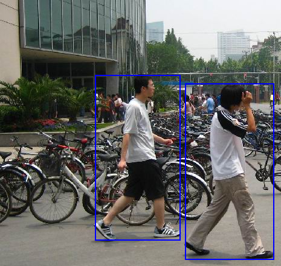 | 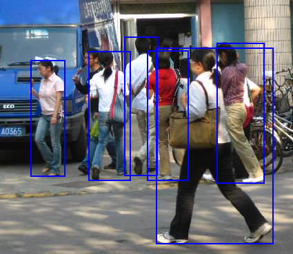| 
| 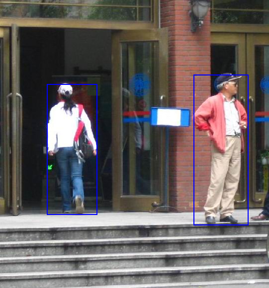 | 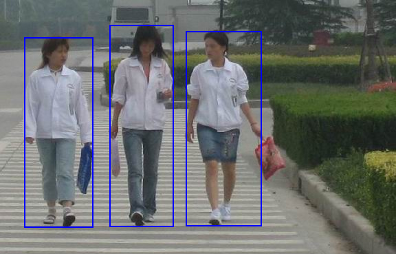| 


**d)** 

Como se pode ver das imagens em cima, cada imagem pode ter mais que um pedestre. No entanto, a rede que pretendemos treinar irá prever apenas um objeto por imagem. Por isso é necessário definir um critério para escolher apenas uma das bounding boxes anotadas como ground truth. Sugere-se o critério da maior bounding box. Assim a rede será treinada apenas com exemplos dos pedestres mais próximos e maiores, e deverá aprender a prever apenas esses.

Crie um método **`getArea`** na classe BBox que calcule a àrea de uma bounding box. 

Depois, no método **`__init__`** da classe dataset, utilize esse método para criar uma lista **largest_bbox_per_image** que contém apenas a maior bounding box por imagem, e uma lista de listas **smaller_bboxes_per_image**, que contém para cada imagem uma lista de todas as bounding boxes que não são a maior.

Grave imagens com essas bouding boxes desenhadas a verde na pasta **<experiment_path>/\<train or test\>/largest_and_smaller**.

|  |  |
|:-------------:|:--------------:|
| 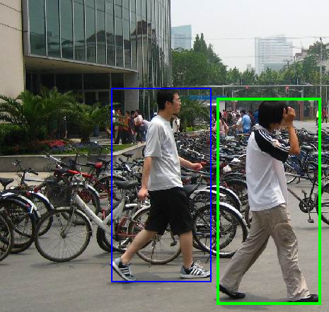 | 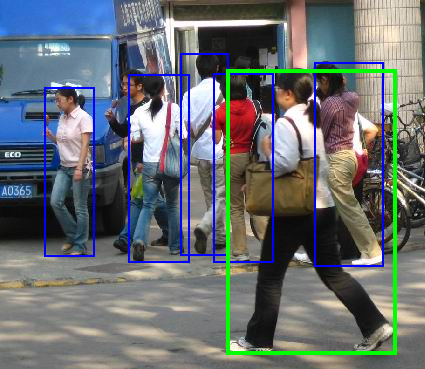| 
| 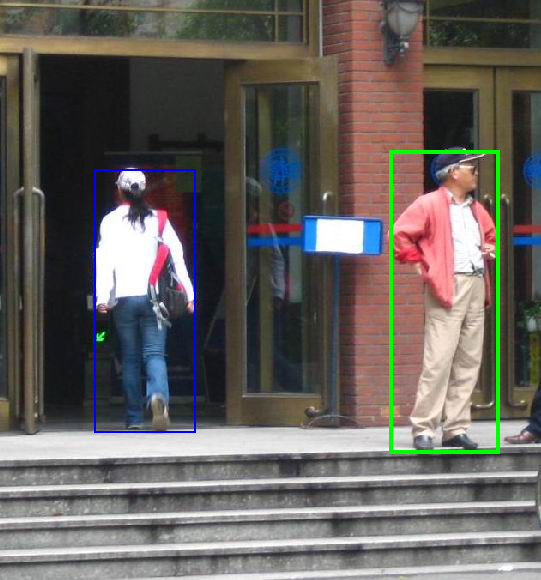 | 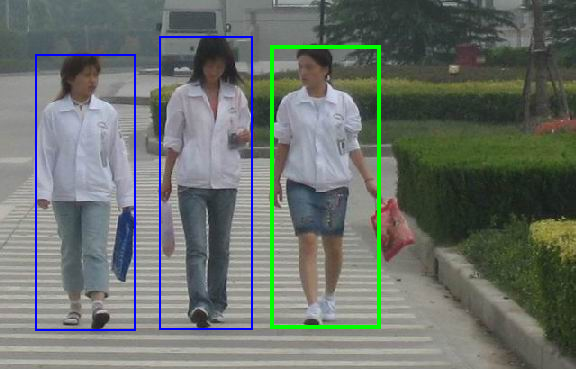| 


### Ex3 Adaptação do método **`__getitem__`** da classe dataset para geração dos tensores

Recorde-se que o que se pretende que a rede gere são quatro valores correspondentes ao $x,y,w,h$ da bounding box (ver acima). 

O método **`__getitem__``** tem de retornar os tensores de entrada e saída da rede, sendo que o tensor de saída terá tamanho 4.

**a)** 

Como vimos acima as imagens do dataset podem conter vários pedestres. O procedimento para escolha de uma dessas bounding boxes já foi feito anteriormente. O que se pretende agora é utilizar esta informação para pintar de preto na imagem todos os pedestres que não foram selecionados.

|  |  |
|:-------------:|:--------------:|
| 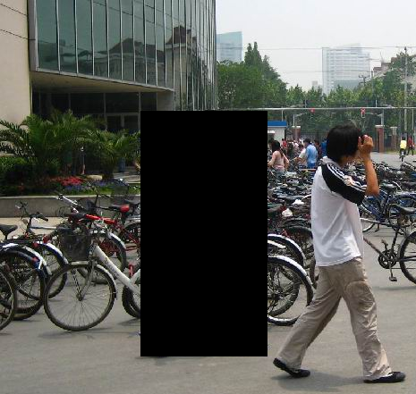 | 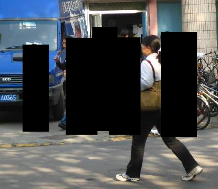| 
| 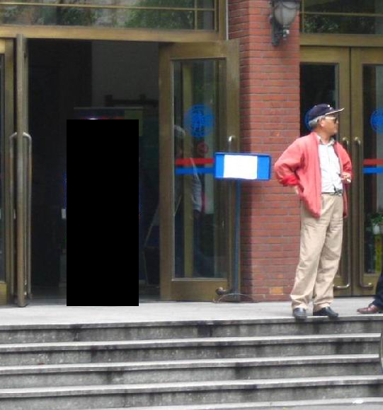 | | 

**Nota importante:** estas imagens serão datas à rede para treino. Não devem ter as bouding boxes pintadas.

**b)** 

Como se pode ver nas imagens acima, os vários exemplos do dataset contêm imagens de tamanho variável, o que não acontecia no dataset Mnist. No entanto, as redes convolucionais necessitam de ter uma entrada de tamanho fixo. é Portanto necessário **redimensionar as imagens** do dataset para um tamanho fixo.

O tamanho alvo da imagem para entrada na rede será de 256x256. Assumindo que a maioria das imagens do dataset são aproximadamente quadradas, pode-se assumir que o aspect ratio da imagem não será significativamente alterado e fazer um resize direto com a função: 

    resized_image = image.resize((width, height), Image.Resampling.LANCZOS)

Grave as imagens para a pasta **<experiment_path>/\<train or test\>/resized** para validar o procedimento de redimensionamento.

|  |  |
|:-------------:|:--------------:|
| 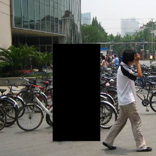 | | 
|  | 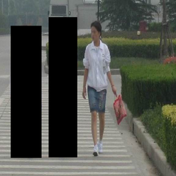| 


**c)**

Gere o tensor da imagem. Para converter uma imagem pil para tensor utilize:

    self.to_tensor = transforms.ToTensor()
    image_tensor = self.to_tensor(image_pil)

Imprima o tensor da imagem e verifique que o tamanho é o esperado.

**d)**

Gere o tensor da bounding box. Note que os valores das bounding boxes deverão estar no intervalo $[0,1]$ pois estes valores são mais fáceis de aprender pela rede. Também é recomendado utilizar o formato xywh em vez do xyxy. Porquê?

Imprima o tensor da bounding box e verifique que o tamanho é o esperado.

Retorne ambos os tensores na função **`__getitem__`**.

### Ex4 Arquitetura de um modelo simples para Deteção

**a)**

Defina uma classe modelo denominada **`SimpleDetectorModel`** de baixa capacidade com uma sequencia inicial de convolução seguida de uma sequência de camadas fully connected, que resulta em 4 saídas moduladas por uma função sigmóide.

Uma sugestão:

```terminal
Model architecture initialized with 9424 parameters.
==========================================================================================
Layer (type:depth-idx)                   Output Shape              Param #
==========================================================================================
SimpleDetectorModel                      [1, 4]                    --
├─Conv2d: 1-1                            [1, 16, 256, 256]         448
├─MaxPool2d: 1-2                         [1, 16, 128, 128]         --
├─Conv2d: 1-3                            [1, 12, 128, 128]         1,740
├─MaxPool2d: 1-4                         [1, 12, 64, 64]           --
├─Conv2d: 1-5                            [1, 64, 64, 64]           6,976
├─MaxPool2d: 1-6                         [1, 64, 32, 32]           --
├─AdaptiveAvgPool2d: 1-7                 [1, 64, 1, 1]             --
├─Linear: 1-8                            [1, 4]                    260
==========================================================================================
Total params: 9,424
Trainable params: 9,424
Non-trainable params: 0
Total mult-adds (Units.MEGABYTES): 86.44
==========================================================================================
Input size (MB): 0.79
Forward/backward pass size (MB): 12.06
Params size (MB): 0.04
Estimated Total Size (MB): 12.88
==========================================================================================
```

**b)**

Treine o modelo durante algumas épocas e veja se a rede consegue convergir.

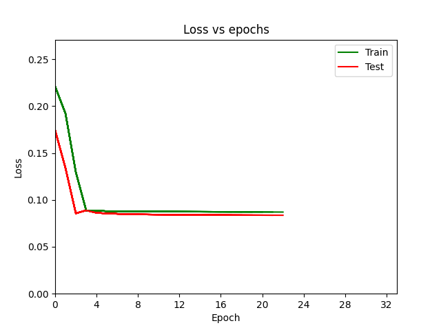


**c)** 

Para analisar qualitativamente a performance do modelo, visualize as imagens com a ground_truth bounding box e a predicted bounding box sobrepostas.

Crie na classe **`Trainer`** um método denominado **`saveResults`** que grave todas as imagens com as bounding boxes sobrepostas.

Na figura em baixo mostram-se as bounding boxes ground truth a verde, e as estimadas a vermelho.

|  |  |
|:-------------:|:--------------:|
| 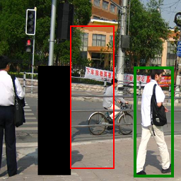 | 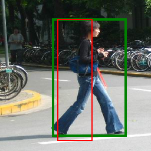| 
| 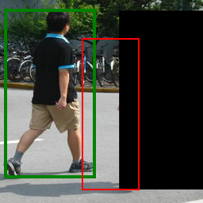 | 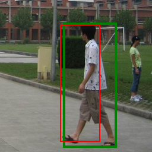| 


## Ex5 Transfer Learning

**a)** 

A VGGNet é uma arquitetura de Rede Neural Convolucional (CNN) desenvolvida em 2014 pelo Grupo de Geometria Visual da Universidade de Oxford, que se notabilizou por demonstrar a importância da profundidade da rede na precisão da classificação de imagens. O seu design enfatiza a simplicidade, empregando pilhas de pequenos filtros convolucionais de 3x3 e camadas de max-pooling de 2x2. Esta abordagem consistente e elegante revelou-se altamente eficaz, levando à sua ampla adoção. A VGGNet existe em diversas configurações, como VGG-11, VGG-16 e VGG-19, que variam na profundidade, mas mantêm os mesmos princípios fundamentais.

O transfer learning com VGG-11 consiste em aproveitar os pesos pré-treinados e as características aprendidas desta arquitetura para novos conjuntos de dados ou tarefas de visão computacional. A VGG-11, com as suas 11 camadas ponderadas (8 convolucionais e 3 totalmente conectadas), quando pré-treinada em grandes bases de dados como o ImageNet, já adquiriu a capacidade de extrair uma vasta hierarquia de características genéricas das imagens. Neste método de transfer learning, as camadas convolucionais pré-treinadas são normalmente "congeladas" (os seus pesos não são alterados), enquanto as últimas camadas totalmente conectadas são substituídas e retreinadas para o novo dataset. Esta técnica otimiza o tempo de treino e os recursos computacionais, permitindo um elevado desempenho mesmo com dados de treino limitados, pois o modelo beneficia do conhecimento extenso adquirido na sua formação inicial.

A arquitetura da rede versão VGG11 é mostrada na seguinte figura:

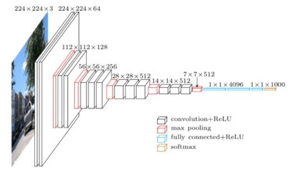

E o sumário na rede é o seguinte:

```
VGG backbone layers frozen.
Transfer Model architecture initialized with 66180 parameters.
==========================================================================================
Layer (type:depth-idx)                   Output Shape              Param #
==========================================================================================
VGGModelDetector                         [1, 4]                    --
├─Sequential: 1-1                        [1, 512, 8, 8]            --
│    └─Conv2d: 2-1                       [1, 64, 256, 256]         (1,792)
│    └─BatchNorm2d: 2-2                  [1, 64, 256, 256]         (128)
│    └─ReLU: 2-3                         [1, 64, 256, 256]         --
│    └─MaxPool2d: 2-4                    [1, 64, 128, 128]         --
│    └─Conv2d: 2-5                       [1, 128, 128, 128]        (73,856)
│    └─BatchNorm2d: 2-6                  [1, 128, 128, 128]        (256)
│    └─ReLU: 2-7                         [1, 128, 128, 128]        --
│    └─MaxPool2d: 2-8                    [1, 128, 64, 64]          --
│    └─Conv2d: 2-9                       [1, 256, 64, 64]          (295,168)
│    └─BatchNorm2d: 2-10                 [1, 256, 64, 64]          (512)
│    └─ReLU: 2-11                        [1, 256, 64, 64]          --
│    └─Conv2d: 2-12                      [1, 256, 64, 64]          (590,080)
│    └─BatchNorm2d: 2-13                 [1, 256, 64, 64]          (512)
│    └─ReLU: 2-14                        [1, 256, 64, 64]          --
│    └─MaxPool2d: 2-15                   [1, 256, 32, 32]          --
│    └─Conv2d: 2-16                      [1, 512, 32, 32]          (1,180,160)
│    └─BatchNorm2d: 2-17                 [1, 512, 32, 32]          (1,024)
│    └─ReLU: 2-18                        [1, 512, 32, 32]          --
│    └─Conv2d: 2-19                      [1, 512, 32, 32]          (2,359,808)
│    └─BatchNorm2d: 2-20                 [1, 512, 32, 32]          (1,024)
│    └─ReLU: 2-21                        [1, 512, 32, 32]          --
│    └─MaxPool2d: 2-22                   [1, 512, 16, 16]          --
│    └─Conv2d: 2-23                      [1, 512, 16, 16]          (2,359,808)
│    └─BatchNorm2d: 2-24                 [1, 512, 16, 16]          (1,024)
│    └─ReLU: 2-25                        [1, 512, 16, 16]          --
│    └─Conv2d: 2-26                      [1, 512, 16, 16]          (2,359,808)
│    └─BatchNorm2d: 2-27                 [1, 512, 16, 16]          (1,024)
│    └─ReLU: 2-28                        [1, 512, 16, 16]          --
│    └─MaxPool2d: 2-29                   [1, 512, 8, 8]            --
├─AdaptiveAvgPool2d: 1-2                 [1, 512, 1, 1]            --
├─Sequential: 1-3                        [1, 4]                    --
│    └─Linear: 2-30                      [1, 128]                  65,664
│    └─ReLU: 2-31                        [1, 128]                  --
│    └─Identity: 2-32                    [1, 128]                  --
│    └─Linear: 2-33                      [1, 4]                    516
│    └─Sigmoid: 2-34                     [1, 4]                    --
==========================================================================================
Total params: 9,292,164
Trainable params: 66,180
Non-trainable params: 9,225,984
Total mult-adds (Units.GIGABYTES): 9.79
==========================================================================================
Input size (MB): 0.79
Forward/backward pass size (MB): 155.19
Params size (MB): 37.17
Estimated Total Size (MB): 193.15
==========================================================================================
```

Implemente e treine um novo modelo do tipo vgg11. Use os pesos pregravados para o imagenet e extraia apenas a componente de convolução da arquitetura vgg denominada `features`. Depois encaixe uma sequência de redes fully connected no vetor de saída da camada convolucional.

**b)** 

A ResNet-18, uma variante das Redes Residuais (ResNet), surgiu em 2015 e revolucionou o treino de redes neurais profundas ao mitigar o problema da dissipação do gradiente. Enquanto a VGGNet visava aprofundar a rede empilhando camadas convolucionais de 3x3 sequencialmente, esta abordagem enfrentava dificuldades na otimização de modelos muito profundos devido à atenuação dos gradientes durante a retropropagação. A ResNet-18, por outro lado, introduz "ligações residuais" ou "atalhos" (skip connections) que permitem que a informação e os gradientes fluam diretamente através de múltiplas camadas, contornando algumas delas. Esta inovação possibilitou a construção de arquiteturas significativamente mais profundas, como a ResNet-18 com 18 camadas, sem a degradação do desempenho observada em redes VGG de profundidade comparável, tornando-a uma opção mais robusta e eficiente para tarefas de classificação de imagem, muitas vezes superando a VGG em precisão e velocidade de processamento.

A arquitetura da rede resnet18 é mostrada na seguinte figura:

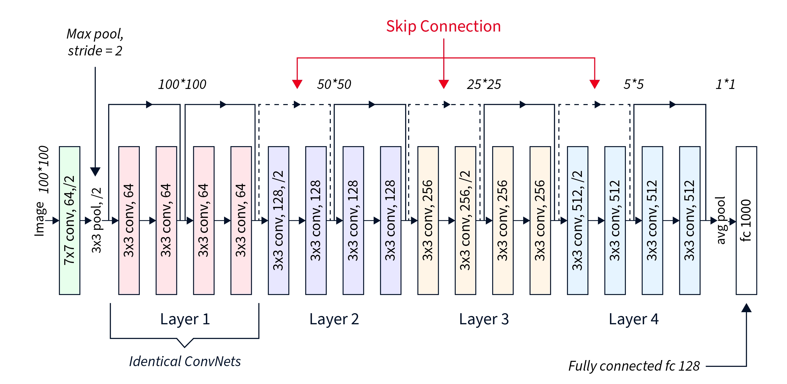

E o sumário na rede é o seguinte:

``` 
===============================================================================================
Layer (type:depth-idx)                        Output Shape              Param #
===============================================================================================
ResnetDetectorModel                           [1, 4]                    --
├─Sequential: 1-1                             [1, 512, 1, 1]            --
│    └─Conv2d: 2-1                            [1, 64, 128, 128]         9,408
│    └─BatchNorm2d: 2-2                       [1, 64, 128, 128]         128
│    └─ReLU: 2-3                              [1, 64, 128, 128]         --
│    └─MaxPool2d: 2-4                         [1, 64, 64, 64]           --
│    └─Sequential: 2-5                        [1, 64, 64, 64]           --
│    │    └─BasicBlock: 3-1                   [1, 64, 64, 64]           73,984
│    │    └─BasicBlock: 3-2                   [1, 64, 64, 64]           73,984
│    └─Sequential: 2-6                        [1, 128, 32, 32]          --
│    │    └─BasicBlock: 3-3                   [1, 128, 32, 32]          230,144
│    │    └─BasicBlock: 3-4                   [1, 128, 32, 32]          295,424
│    └─Sequential: 2-7                        [1, 256, 16, 16]          --
│    │    └─BasicBlock: 3-5                   [1, 256, 16, 16]          919,040
│    │    └─BasicBlock: 3-6                   [1, 256, 16, 16]          1,180,672
│    └─Sequential: 2-8                        [1, 512, 8, 8]            --
│    │    └─BasicBlock: 3-7                   [1, 512, 8, 8]            3,673,088
│    │    └─BasicBlock: 3-8                   [1, 512, 8, 8]            4,720,640
│    └─AdaptiveAvgPool2d: 2-9                 [1, 512, 1, 1]            --
├─Sequential: 1-2                             [1, 4]                    --
│    └─Linear: 2-10                           [1, 256]                  131,328
│    └─ReLU: 2-11                             [1, 256]                  --
│    └─Linear: 2-12                           [1, 128]                  32,896
│    └─ReLU: 2-13                             [1, 128]                  --
│    └─Linear: 2-14                           [1, 4]                    516
│    └─Sigmoid: 2-15                          [1, 4]                    --
===============================================================================================
Total params: 11,341,252
Trainable params: 11,341,252
Non-trainable params: 0
Total mult-adds (Units.GIGABYTES): 2.37
===============================================================================================
Input size (MB): 0.79
Forward/backward pass size (MB): 51.91
Params size (MB): 45.37
Estimated Total Size (MB): 98.06
===============================================================================================
```

Traine esta rede e compare os resultados com o modelo simples e a VGG11.
Um exemplo do treino desta rede na figura em baixo.

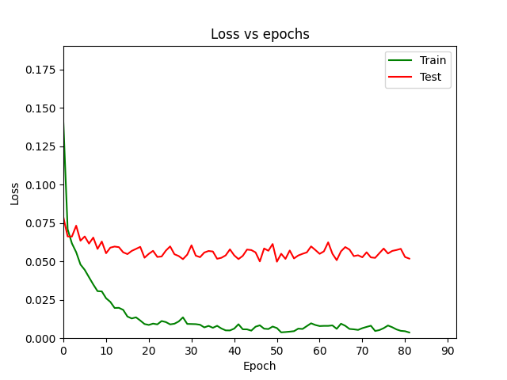

### Ex4 Métricas de avaliação para deteção

A tarefa de deteção é diferente da tarefa de classificação. Assim, é necessário utilizar outras métricas para deteção. O primeiro passo é definir quando é que uma bounding box é corretamente detetada ou não. 

**a)**

O IOU é uma métrica fundamental e amplamente utilizada na área de Visão Computacional, especialmente em tarefas de detecção de objetos e segmentação semântica. Serve para quantificar a sobreposição entre duas regiões, geralmente uma bounding box (caixa delimitadora) prevista por um modelo e uma bounding box de "ground truth" (a anotação verdadeira).

Para calcular o IOU divide-se a área da intersecção (a região onde as duas caixas se sobrepõem) pela área da união (a área total coberta por ambas as caixas, incluindo a intersecção). O resultado é um valor que varia de 0 (sem sobreposição) a 1 (sobreposição perfeita).

Crie um método para comparar duas bounding boxes, calculando a métrica Intersection over Union (IOU).

**b)** 

Implemente um método **`evaluate`** para calcular o IOU para todas as imagens do dataset. Apresente o IOU por imagem e médio para os datasets de treino e teste.

**c)** 

Assuma um limiar para o IOU mínimo para assumir que uma bounding box foi corretamente estimada. Calcule a taxa de acerto (accuracy) do algoritmo. 

**d)** 

Se considerar as bounding boxes que foram ignoradas nas anotações de ground truth, estas métricas mudam significativamente?


## O que aprendemos nesta aula?

Nesta aula, explorámos os fundamentos da deteção de objetos e adquirimos uma série de competências essenciais na área da Visão Computacional:
- Representação e Manipulação de Bounding Boxes: Compreendemos as diferentes convenções (xywh, xyxy) e implementámos uma classe Python para gerir e converter entre elas, bem como desenhá-las em imagens.
- Pré-processamento de Datasets: Aprendemos a estruturar e processar um dataset real (Penn-Fudan) para tarefas de deteção, incluindo a leitura de anotações complexas e a divisão de dados em conjuntos de treino e teste.
- Seleção de Ground Truth: Discutimos e implementámos uma estratégia para selecionar uma única bounding box de ground truth por imagem (a maior), bem como a técnica de "mascaramento" de objetos menores para focar o treino do modelo.
- Adaptação do Dataset para Redes Neurais: Implementámos o método __getitem__ de uma classe torch.utils.data.Dataset para lidar com redimensionamento de imagens, normalização de coordenadas e a transformação de dados em tensores.
- Arquiteturas de Modelos para Deteção: Desenvolvemos modelos de deteção desde uma arquitetura convolucional simples até a utilização de técnicas de Transfer Learning com redes pré-treinadas de última geração, como VGG-11 e ResNet-18.
- Transfer Learning: Entendemos os conceitos de "congelamento" de camadas (freezing) e fine-tuning para aproveitar o conhecimento adquirido em grandes datasets (ImageNet) e adaptá-lo a uma nova tarefa.
- Métricas de Avaliação Específicas: Explorámos métricas cruciais para a deteção de objetos, como o Intersection over Union (IOU), e como usá-lo para avaliar a performance do modelo, calculando a "taxa de acerto" com base num limiar de IOU.
- Análise Qualitativa e Quantitativa: Aprendemos a visualizar as previsões do modelo em relação ao ground truth para uma análise qualitativa, complementando as métricas quantitativas.

Esta aula forneceu uma base sólida para a compreensão e implementação de sistemas de deteção de objetos, preparando o terreno para explorar algoritmos mais avançados e datasets mais complexos no futuro.